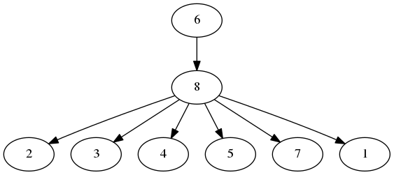

## Learn_CMDL

Learn_CMDL is a Java implementation of a score-based learning algorithm for Bayesian networks. A new proposed scoring function for Bayesian networks called **Complete minimum description length** is implemented. The program receives a data set with multivariate categorical observations and outputs the optimal structure, found by the greedy hill climber (GHC). 

The program comes packaged as an executable JAR file, already including the required external libraries and can be downloaded [here](Learn_CMDL.jar). The source code can be downloaded [here](Learn_CMDL.zip).

In order to visualize the output graph in dot format, download [graphviz](https://graphviz.gitlab.io/download/).


## Usage 

The algorithm receives a .csv file such that:
1. the first row of each column corresponds to the name of an attribute;
1. the other rows correspond to observations of that attribute. 

By executing the following .jar file:
```
$ java -jar Learn_CMDL.jar
```

The  command-line options are the following:
```
--inputFile <file>        Input CSV file to be used for network
                              learning.
--scoringFunction <arg>   Scoring function to be used: CMDL, MDL,
                              LL and K2. CMDL is used by default.
                              
--numRestarts <int>       Number of random restarts for the greedy 
                               hill climber(GHC).

--outputFile <file>       Writes output to <file>. If not supplied,
                             output is written to file 'ouput.dot'.
```
## Example

Consider the benchmarck LED data set [led.csv](led_500.csv) with 500 instances.Taking the following options:
1. CMDL as scoring function;
1. 1000 random restarts for GHC;
1. The output file to be output_led.dot.

The command to learn the optimal network is:

```
java -jar Learn_CMDL.jar led.csv CMDL 1000 out_cmdl
```
And outputs the following structure: 




